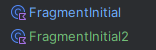

# Android Recicla IA

Código fuente de la aplicación nativa ReciclaIA para Android.

En este documento se explicará la implementación del proyecto, detallando en la medida de lo posible las técnicas, patrones de diseño, configuración y uso de los principales frameworks y librerías.

## 1 Configuración del proyecto

| **Característica**                | Valor                                                                    |
| --------------------------------- | ------------------------------------------------------------------------ |
| **Versión de Android Studio**     | Android Studio Ladybug Feature Drop - 2024.2.11                                |
| **Gradle**                        | `8.10.2` -> `gradle-wrapper.properties`                                         |
| AGP (Android Gradle Plugin)       | `8.8.1` -> `libs.versions.toml`  |
| **Lenguaje configuración Gradle** | Kotlin (Groovy está en vías de desaparecer), ficheros `build.gradle.kts` |
| **Lenguaje código fuente**        | Kotlin `2.0.0` |
| **Plugins**                       | Jetpack View Binding, Jetpack Compose                                             |
| Dependencias adicionales          | Jetpack-lifecycle-viewmodel, jetpack-navigation, jetpack-room, dagger-hilt            |
| Gestor de dependencias            | Version catalog (archivo toml)                                           |
| Procesador de anotaciones         | ksp (en lugar de kapt)                                                   |
| Versión del compilador            | Kotlin K2                                                                |

### 1.1 Versiones de Gradle y AGP


### 1.2 Sistema de gestor de dependencias - Version catalog

* Este nuevo sistema se ha adoptado para este proyecto, facilita el control de versiones desde un único fichero `libs.versions.toml`. 
* La declaración de dependencias en el fichero `build.gradle.kts` se simplifica

[Información oficial](https://developer.android.com/build/migrate-to-catalogs)


### 1.3 Procesado de anotaciones ksp

* El plugin de procesado de anotaciones en el código KSP en sustitución de KAPT, mejora el rendimiento.
* En las nuevas versiones del IDE Android Studio, se incluye por defecto, de manera que no hay que configurar nada.
* A la hora de utilizarlo:

```kotlin
dependencies {
    kapt("androidx.room:room-compiler:2.5.0") //Obsoleto Kapt
    ksp("androidx.room:room-compiler:2.5.0") //KSP
}
```

### 1.4 Versión del compilador K2 y Kotlin 2


Esta nueva versión del compilador está en fase beta, no obstante, lo probaré y documentaré posibles incompatibilidades, en ese caso se desactivará para este proyecto.

### 1.5 Uso de Jetpack Compose en el proyecto

Las vistas se generarán principalmente de la manerá clásica basadas en `View` y XML. Sin embargo, y debido a la popularidad del framework de UI Compose, se harán integraciones puntuales para estudiar sus ventajas y que sirva este proyecto para ilustrar sus características.

#### ¿Cómo configurar Jetpack Compose en nuestro proyecto?

Al iniciar un proyecto nuevo con la versión del IDE siguiente `Android Studio Ladybug | 2024.2.1 Patch 1` ya se autoconfigura para usar el framework Jetpack Compose. Además con el uso de Kotlin 2, la configuración de Compose se simplifica, al coincidir el número de versión de Kotlin con el del framework. En este caso se configura mediante el plugin de Gradle del Compilador de Compose:

En `libs.versions.toml` :

```toml
[versions]
kotlin = "2.0.0"

[plugins]
org-jetbrains-kotlin-android = { id = "org.jetbrains.kotlin.android", version.ref = "kotlin" }

// Add this line
compose-compiler = { id = "org.jetbrains.kotlin.plugin.compose", version.ref = "kotlin" }
```

En `build.gradle.kts` (nivel proyecto):

```kotlin
plugins {
    alias(libs.plugins.android.application) apply false
    alias(libs.plugins.kotlin.android) apply false
    alias(libs.plugins.kotlin.compose) apply false
}
```

En `build.gradle.kts` (nivel módulo o aplicación):

```kotlin
android {
    ...
    buildFeatures {
        compose = true
        viewBinding = true
    }
}
plugins {
   // Existing plugins
   alias(libs.plugins.compose.compiler)
}
```

[Más información oficial](https://developer.android.com/jetpack/androidx/releases/compose-kotlin)

#### ¿Cómo agregar una vista de Compose en una vista basada en `View` ?

[Información oficial](https://developer.android.com/develop/ui/compose/migrate/interoperability-apis/compose-in-views#compose-in-fragments)

```xml
<LinearLayout xmlns:android="http://schemas.android.com/apk/res/android"
    android:orientation="vertical"
    android:layout_width="match_parent"
    android:layout_height="match_parent">

  <TextView
      android:id="@+id/text"
      android:layout_width="wrap_content"
      android:layout_height="wrap_content" />

  <androidx.compose.ui.platform.ComposeView
      android:id="@+id/compose_view"
      android:layout_width="match_parent"
      android:layout_height="match_parent" />
</LinearLayout>
```

```kotlin
class ExampleFragmentXml : Fragment() {

    override fun onCreateView(
        inflater: LayoutInflater,
        container: ViewGroup?,
        savedInstanceState: Bundle?
    ): View {
        val view = inflater.inflate(R.layout.fragment_example, container, false)
        val composeView = view.findViewById<ComposeView>(R.id.compose_view)
        composeView.apply {
            // Dispose of the Composition when the view's LifecycleOwner
            // is destroyed
            setViewCompositionStrategy(ViewCompositionStrategy.DisposeOnViewTreeLifecycleDestroyed)
            setContent {
                // In Compose world
                MaterialTheme {
                    Text("Hello Compose!")
                }
            }
        }
        return view
    }
}
```

## 2 Jetpack Navigation

La navegación principal entre pantallas de la aplicación se hará utilizando el framework **Jetpack Navigation** con una única actividad que contendrá un objeto `FragmentContainerView` donde se dibujará todas las pantallas principales de la aplicación mediante distintos fragmentos `Fragment` .

### 2.1 Configuración de la actividad principal

Al crear un nuevo proyecto, el IDE Android Studio ya configura por defecto una composición de las vistas con el framework **Jetpack Compose**, y si bien en nuestro proyecto diseñaremos algunas vistas así, el diseño principal seguirá siendo con `View` . En este caso vamos a cambiar la clase principal generada para ser utilizada con Compose, para ello debemos hacer que la actividad principal herede de la clase `AppCompatActivity` en lugar de `ComponentActivity` :

Fichero `build.gradle.kts` :

```kotlin
dependencies {
    ...
    //custom
    implementation(libs.androidx.appcompat)
}
```

Fichero `libs.versions.toml` :

```toml
[versions]
...
appcompat = "1.7.0"
navigationUiKtx = "2.8.5"
safeArgs = "2.8.5"

[libraries]
...
androidx-appcompat = { module = "androidx.appcompat:appcompat", version.ref = "appcompat" }
androidx-navigation-dynamic-features-fragment = { module = "androidx.navigation:navigation-dynamic-features-fragment", version.ref = "navigationUiKtx" }
androidx-navigation-fragment-ktx = { module = "androidx.navigation:navigation-fragment-ktx", version.ref = "navigationUiKtx" }
androidx-navigation-ui-ktx = { module = "androidx.navigation:navigation-ui-ktx", version.ref = "navigationUiKtx" }

[plugins]
...
safeargs = { id = "androidx.navigation.safeargs.kotlin", version.ref = "safeArgs"}
```

**Actividad configurada para *Compose*:**

```kotlin
class MainActivity : ComponentActivity() {
    override fun onCreate(savedInstanceState: Bundle?) {
        super.onCreate(savedInstanceState)
        //enableEdgeToEdge()
        setContent {
            ReciclaIATheme {
                Scaffold(modifier = Modifier.fillMaxSize()) { innerPadding ->
                    Greeting(
                        name = "Android",
                        modifier = Modifier.padding(innerPadding)
                    )
                }
            }
        }
    }
}
```

**Actividad configurada con *View* y *View Binding*:**

```kotlin
class MainActivity : AppCompatActivity() {
    private lateinit var binding: ActivityMainBinding
    override fun onCreate(savedInstanceState: Bundle?) {
        super.onCreate(savedInstanceState)
        binding = ActivityMainBinding.inflate(layoutInflater)
        setContentView(binding.root)
    }
}
```

**Elección del tema del sistema correcto**

La aplicación dara un error de runtime si no elegimos un tema que herede de `Theme.AppCompat` , pero al iniciar el proyecto generó uno que hereda de Theme:

Tema no compatible con `AppCompat` :

```xml
<?xml version="1.0" encoding="utf-8"?>
<resources>

    <style name="Theme.MyApplication" parent="android:Theme.Material.Light.NoActionBar" />
</resources>
```

Tema que sí hereda de `Theme.AppCompat` :

```xml
<resources>
    <style name="Theme.ReciclaIA" parent="Theme.MaterialComponents.DayNight.NoActionBar" />
</resources>
```

Al configurar las vistas con View partiendo de un proyecto preconfigurado para Compose, tenemos que hacer todo el trabajo manualmente, existen dos nuevos problemas que solucionar: 
1. Las vistas no evitan la zona de la cámara selfie, u otros elementos de de tipo borde o del sistema.
1. Se configura en fullscreen o sin la barra de estado visible


Solución al caso 1: 
Debemos configurar el atributo del sistema `fitsSystemWindows` a `true` en el layout principal de la aplicación, normalmente el layout padre de `activity_main.xml` :

```xml
<attr name="fitsSystemWindows" format="boolean" />
```

Uso en el layout de la actividad principal `activity_main.xml`:

```xml
<LinearLayout xmlns:android="http://schemas.android.com/apk/res/android"
    xmlns:app="http://schemas.android.com/apk/res-auto"
    xmlns:tools="http://schemas.android.com/tools"
    android:orientation="vertical"
    android:layout_width="match_parent"
    android:layout_height="match_parent"
    android:fitsSystemWindows="true">...</LinearLayout>
```


Solución al caso 2: 
Aparentemente la barra de estado no aparece, nada más lejos de la realidad, es transparente con texto e iconos blancos, debemos ajustar el tema para que sea adecuado según el fondo de la vista, manteniendo el fondo transparente (tendendia de Material3) usaremos la propiedad `android:windowLightStatusBar`:
```xml
<resources>
    <style name="Theme.ReciclaIA" parent="Theme.MaterialComponents.DayNight.NoActionBar">
        <item name="android:windowLightStatusBar">true</item>
    </style>
</resources>
```

Tema utilizando Material 3 para utilización de colores dinámicos (se explicará más adelante):
```xml
    <style name="Theme.ReciclaIA" parent="Theme.Material3.DayNight.NoActionBar">
        <item name="android:windowLightStatusBar">true</item>
    </style>
</resources>
```


- Nota: Puede resultar confuso que el estado `windowLightStatusBar:true` ofrezca el texto en oscuro y viceversa, pero es correcto, pues el color del texto es el de contraste con el fondo claro, que es lo que aplica en esta configuración.
___

La aplicación tendrá una única actividad (AppCompatActivity) y las distintas pantallas de la aplicación se implementarán con fragmentos (Fragment), cuya navegación se gestionará con el mencionado framework Jetpack Navigation, así tendremos este componente en la actividad principal:

```xml
    <androidx.fragment.app.FragmentContainerView
        android:id="@+id/hostNavFragment"
        android:name="androidx.navigation.fragment.NavHostFragment"
        android:layout_width="match_parent"
        android:layout_height="match_parent"
        app:defaultNavHost="true"
        app:navGraph="@navigation/host"
        tools:layout_editor_absoluteX="1dp"
        tools:layout_editor_absoluteY="1dp" />
```

Una vez que la actividad principal esté preparada para trabajar con View, lo siguiente es continuar con la configuración para funcionar con Jetpack Navigation, los pasos que he seguido los describo a continuación.

### 2.2 Creación de un par de fragmentos para probar la navegación

Voy a crear un par de Fragmentos sencillos para probar que la navegación funciona correctamente. 



### 2.3 Creación del gráfico de navegación

Es necesario crear un fichero xml en la carpeta `navigation` que llamaremos `host.xml`:
- Creación de la carpeta
- Click derecho sobre carpeta y elegir *new Navigation File*


La edición del gráfico de navegación, al igual que las vistas usando View, se puede realizar gráficamente o editando el xml. Lo más comodo es usar la parte gráfica y editar alguna característica concreta usando el xml cuando sea necesario.


### 2.4 Realización de una navegación sencilla | **Conceptos tratados**: *[herencia](https://es.wikipedia.org/wiki/Herencia_(inform%C3%A1tica))*

Llegados a este punto, vamos a navegar desde un fragmento hacia el otro y viceversa. Voy a crear una clase abstracta de la que heredarán la mayoría de nuestras vistas, así podemos agregar funcionalidad común, se llamará `FragmentBase`:

```kotlin
abstract class FragmentBase : Fragment(), ILog {
    abstract fun goBack()
    abstract fun getFragmentTag(): String
}
...

interface ILog {
    fun logDebug(message: String) = Log.d(theTag(), message)
    fun logError(message: String) = Log.e(theTag(), message)
    fun theTag(): String
}
```

Para navegar entre fragmentos, usaremos la funcionalidad de navegación segura gracias al plugin **Safe Args** `androidx.navigation.safeargs.kotlin`:

```kotlin
 binding.textViewOrigen.setOnClickListener {
            findNavController()
                .navigate(FragmentInitialDirections.actionFragmentInitialToFragmentInitial2())
        }
```

Centrémonos ahora en el método `goBack()`:

```kotlin
class FragmentInitial2 : FragmentBase() {
    private lateinit var binding: FragmentInitial2Binding
    
    override fun goBack() {
        findNavController().popBackStack()
    }
    
    override fun initProperties() {
        binding.textViewDestino.setOnClickListener {
            goBack()
        }
    }
```

Funcionamiento correcto.

### 2.5 Configuración avanzada del botón atrás | **Conceptos tratados**: *[recursión](https://es.wikipedia.org/wiki/Recursi%C3%B3n), [herencia](https://es.wikipedia.org/wiki/Herencia_(inform%C3%A1tica)), [Principio de inversión de la dependencia (S.O.L.I.**D.**)](https://es.wikipedia.org/wiki/SOLID)*

Con el siguiente desarrollo se predende interceptar la acción del botón atrás del dispositivo, para realizar la navegación que convenga en cada pantalla de la aplicación. De manera general con el gráfico de navegación es suficiente, pero en algunas pantallas es posible que queramos capturar esa acción para por ejemplo solicitar una confirmación del usuario o realizar otras acciones antes de volver atrás. Esto **lo capturaremos en la actividad principal, MainActivity**, que sabemos que dada nuestra configuración de navegación siempre o casi siempre (puede que se abran algunas otras actividades, ya se verá más adelante):

```kotlin
//En MainActivity
    override fun onKeyDown(keyCode: Int, event: KeyEvent?): Boolean {
        if(keyCode == KeyEvent.KEYCODE_BACK) {
            //acción a configurar
            return true
        }
        return false
    }
```

Ahora debemos diseñar un mecanismo para que se llame al método `goBack()` que hemos creado antes en la clase abstracta de la que heredarán todos los fragmentos, `FragmentBase`. Analizando el funcionamiento general de los fragmentos en Android, nos damos cuenta de que puede darse una estructura tipo árbol, con fragmentos hijos dentro de un padre. Además, debemos hallar el fragmento "activo" y entonces llamar a su método `goBack()` (Nótese que se tendrá que comprobar que el fragmento sea del tipo `FragmentBase`).


Vamos a crear una interfaz (más adelante desarrollaremos la implementación) que contenga el método que necesitamos, de la siguiente manera:

```kotlin
interface IBackPressedListener {
    fun handleBackPressed(a: AppCompatActivity, idHostFragment: Int)
}
object BackPressedListener : IBackPressedListener {
    override fun handleBackPressed(a: AppCompatActivity, idHostFragment: Int) {
        TODO("Not yet implemented")
    }
}
...
// En MainActivity
    private val backPressedListener: IBackPressedListener = BackPressedListener

    override fun onKeyDown(keyCode: Int, event: KeyEvent?): Boolean {
        if(keyCode == KeyEvent.KEYCODE_BACK) {
            backPressedListener.handleBackPressed(this, binding.hostNavFragment.id)
            return true
        }
        return false
    }

```

#### Recorriendo el árbol de fragmentos anidados | **Conceptos tratados:** *[recursión](https://es.wikipedia.org/wiki/Recursi%C3%B3n)*

Voy a crear una función recursiva que recorra el posible árbol de fragmentos, y así conseguir que funcione en todos los posibles casos. Recorreré el árbol en busca de "hojas", es decir aquellos fragmentos que no tienen hijos:

```kotlin
private fun getLeaves(childFragmentManager: FragmentManager?): List<Fragment> {
        val childFragments = childFragmentManager?.fragments
        if (childFragments.isNullOrEmpty()) return listOf()
        val leaves = arrayListOf<Fragment>()
        for(fragment in childFragments) {
            val innerFragments = fragment.childFragmentManager.fragments
            if (innerFragments.isEmpty()) {
                leaves.add(fragment)
            } else {
                leaves.addAll(getLeaves(fragment.childFragmentManager))
            }
        }
        return leaves
    }
```

Ahora ya puedo definir la función que gestiona la acción de ir atrás:

```kotlin
object BackPressedListener : IBackPressedListener {
    override fun handleBackPressed(a: AppCompatActivity, idHostFragment: Int) {
        val fm = a.supportFragmentManager.findFragmentById(idHostFragment)?.childFragmentManager
        
        getLeaves(fm).forEach {
            if (it is FragmentBase) {
                if(it.isAdded) it.goBack()
            }
        }
    }
}
```

## 3 Inyección de dependencias con Hilt

[Documentación oficial](https://developer.android.com/training/dependency-injection/hilt-android#kts)

Se trata de la librería oficial para la inyección de dependencias de Android.

### 3.1 Agregar las dependencias al proyecto Android

Edición del fichero `libs.versions.toml`

```toml
[versions]
kspVersion = "2.0.0-1.0.23"
hiltVersion = "2.51.1"

[libraries]
hilt-android = { group = "com.google.dagger", name = "hilt-android" , version.ref = "hiltVersion"}
hilt-compiler = { group = "com.google.dagger", name = "hilt-compiler" , version.ref = "hiltVersion"}

[plugins]
kotlinAndroidKsp = { id = "com.google.devtools.ksp", version.ref ="kspVersion" }
hiltAndroid = { id = "com.google.dagger.hilt.android", version.ref ="hiltVersion" }
```

Configuración en `build.gradle.kts` a nivel de proyecto:

```kotlin
    plugins {
        alias(libs.plugins.hiltAndroid) apply false
        alias(libs.plugins.kotlinAndroidKsp) apply false
    }
```

Edición del fichero `build.gradle.kts` a nivel de aplicación o módulo:

```kotlin
    plugins {
        alias(libs.plugins.kotlinAndroidKsp) //Habilita el plugin KSP que proporciona mayor rendimiento que KAPT
        alias(libs.plugins.hiltAndroid)
    }

    dependencies {
        implementation(libs.hilt.android)
        ksp(libs.hilt.compiler)
    }
```

### 3.2 Configuración Hilt inicial básica

Es necesario realizar una serie de pasos que son comunes en la inyección de dependencias con Dagger Hilt:

#### Creación de clase que herede de Application

Marcamos la clase con la etiqueta `@HiltAndroidApp`, quedando de esta manera:

```kotlin
package com.ingencode.reciclaia.di
import android.app.Application
import dagger.hilt.android.HiltAndroidApp
@HiltAndroidApp
class ReciclaIAApp: Application()
```

Ahora debemos indicar en el fichero de configuración `AndroidManifest.xml` esta clase en el parámetro `name`:
```xml
<application
    ...
    android:name=".di.ReciclaIAApp"
    ...
</application>
```

#### Marcar la actividad principal como punto de entrada en Android

Para indicarle a Hilt que el punto de entrada de nuestra aplicación es la actividad principal, lo haremos marcando con la etiqueta `@AndroidEntryPoint`:

```kotlin
@AndroidEntryPoint
class MainActivity : AppCompatActivity()
```

### 3.3 Inyección de dependencias propias | **Conceptos tratados**: *POO: composición y acoplamiento, inversión del control con inyección de dependencias*

Vamos a refactorizar ya algo del código que hemos hecho hasta ahora haciendo un uso correcto de la inyección de dependencias con Dagger Hilt. Si empezamos analizando la actividad principal, nos damos cuenta de que hemos realizado un acoplamiento con la implementación concreta para la interfaz `IBackPressedListener` creando una relación de "Composición":

```kotlin
class MainActivity : AppCompatActivity() {
    private val backPressedListener: IBackPressedListener = BackPressedListener
    ...
}
```

Usando Dagger Hilt a nivel de inyección de propiedades o atributos de una clase, realizamos el desacomplamiento:

```kotlin
class MainActivity : AppCompatActivity() {
    @Inject
    lateinit var backPressedListener: IBackPressedListener
    ...
}
```

Sin embargo, esto no es suficiente, debemos proporcionar información a Dagger Hilt para que sepa con qué tipo concreto o clase implementar la interfaz. Esto lo haremos en lo que se denominan "módulos":

```kotlin
@Module
@InstallIn(SingletonComponent::class)
object CommonModule {
    @Singleton
    @Provides
    fun provideBackPressedListener(): IBackPressedListener {
        return BackPressedListener
    }
}
```

#### Aspectos clave

* Uso de `@Module` para indicar que es un módulo de Dagger Hilt
* Uso de `@Provides` en la función que devuelve una implementación concreta de la dependencia, indicando y configurando todo lo necesario

#### Aspectos más profundos

* Uso de `@InstallIn({Generated Component}.class)`
  * Donde {Generated Component} se refiere al alcance de las instancias de las dependencias creadas con Hilt, es la configuración de la vida útil, por así decirlo, y hay varias configuraciones. En este caso hemos utilizado `SingletonComponent.class` (por cierto, no tiene nada que ver con el patrón de diseño Singleton), que se refiere a que tiene un alcance global, o de aplicación. Aquí hay una tabla con todas las posibles opciones disponibles:
  * 

Puede que para nuestro ejemplo no fuera necesario el uso de Hilt, pero sirve perfectamente para ilustrar su funcionamiento y no está mal dejarlo así. Se intentará usar todo lo posible Hilt en el proyecto para un código más modular, testeable y limpio.


### 3.4 Inyección de dependencias de terceros - Retrofit (comunicación con servidor)

Voy a incluir este apartado ya, para hacer uso de la inyección de dependencias de terceros. Vamos a incluir algunas herramientas útiles para la comunicación con el servidor: Gson, Retrofit y el adapter para retrofit de Gson y un interceptor, Okhttp3 que analizaremos más adelante, pero básicamente nos permitirá centralizar la gestión de errores de servidor, refresco de token de acceso, autorizaciones y generación de encabezados desde un único sitio.

#### Dependencias

`libs.versions.toml` :

```toml
[versions]
gson = "2.10.1"
retrofitVersion = "2.9.0"

[libraries]
gson = { module = "com.google.code.gson:gson", version.ref = "gson" }
retrofit = { module = "com.squareup.retrofit2:retrofit", version.ref = "retrofitVersion" }
retrofit-converter-gson = { module = "com.squareup.retrofit2:converter-gson", version.ref = "retrofitVersion" }
retrofit-logging-interceptor = { module = "com.squareup.okhttp3:logging-interceptor", version.ref = "loggingInterceptor" }
```

`build.gradle.kts` :

```kotlin
dependencies {
    implementation(libs.retrofit)
    implementation(libs.gson)
    implementation(libs.retrofit.converter.gson)
    implementation(libs.retrofit.logging.interceptor)
}
```

Declaración del módulo:

```kotlin
@Module
@InstallIn(SingletonComponent::class)
class NetworkModule {

    @Singleton
    @Provides
    fun provideRetrofit(): Retrofit {
        return Retrofit.Builder()
            .baseUrl(Routes.BASE_URL)
            .addConverterFactory(StringConverterFactory())
            .addConverterFactory(GsonConverterFactory.create())
            .client(buildOkHttpClient())
            .build()
    }

    @Provides
    @Singleton
    fun provideTest(retrofit: Retrofit): Apis.TestApi = retrofit.create(Apis.TestApi::class.java)

    private fun buildOkHttpClient(): OkHttpClient {
        val logging = HttpLoggingInterceptor().apply { level = HttpLoggingInterceptor.Level.BODY }
        val okHttpClient = OkHttpClient.Builder().addInterceptor(logging).build()
        return okHttpClient
    }
}

class StringConverterFactory : Converter.Factory() {
    override fun responseBodyConverter(
        type: Type,
        annotations: Array<Annotation>,
        retrofit: Retrofit
    ): Converter<ResponseBody, *>? {
        return if (type == String::class.java) {
            Converter<ResponseBody, String> { it.string() }
        } else {
            null
        }
    }
}

---

interface Apis {
    interface TestApi {
        @GET(Routes.ApisEndpoints.TestApi.TEST)
        suspend fun getTest(): Response<String>

        @GET(Routes.ApisEndpoints.TestApi.TESTDB)
        suspend fun getTestDb(): Response<List<TestResponseDb>>
    }
}

---
object Routes {
    const val BASE_URL = "https://jesusmarvaz.hopto.org/apis/reciclaia/"

    object PathParams {
        const val ID = "id"
    }

    object Headers {
        const val TOKEN_HEADER = "authorization"
    }

    object ApisEndpoints {
        object TestApi {
            const val TEST = "test"
            const val TESTDB = "testdb"
        }
    }
}
```

NOTA: la creación de la API alojada en "https://jesusmarvaz.hopto.org/apis/reciclaia/" se explicará en el README.md del proyecto de backend correspondiente.

#### Pruebas de comunicación con la API

Vamos a consumir el par de endpoints de prueba para comprobar que todo funciona correctamente hasta ahora.

```kotlin
override fun initProperties() {
        binding.textViewDestino.setOnClickListener {
            goBack()
        }
        binding.buttonTest.setOnClickListener {
            viewModel.getTest()
        }
        binding.buttonTestDb.setOnClickListener {
            viewModel.getTestDb()
        }
```

`ViewModel`:

```kotlin
@HiltViewModel
class FragmentInitialViewModel @Inject constructor(private val testApiProvider: Apis.TestApi) : ViewModelBase(), ILog {
    private val textLiveData: MutableLiveData<String> = MutableLiveData<String>()
    val observableText: LiveData<String> = textLiveData

    private val dbTestLiveData: MutableLiveData<List<TestResponseDb>> = MutableLiveData<List<TestResponseDb>>()
    val observableDbTestData: LiveData<List<TestResponseDb>> = dbTestLiveData

    fun getTest() {
        viewModelScope.launch {
            try {
                val response = testApiProvider.getTest()
                response.body()?.toString()?.let {
                    textLiveData.postValue(it)
                }
            } catch (e: Exception) {
                logError(e.stackTrace.toString())
                e.printStackTrace()
            }
        }
    }

    fun getTestDb() {
        viewModelScope.launch {
            try {
                val response = testApiProvider.getTestDb()
                response.body()?.let {
                    dbTestLiveData.postValue(it)
                }
            } catch (e: Exception) {
                logError(e.stackTrace.toString())
                e.printStackTrace()
            }
        }
    }
```


## 4 Tema de la aplicación | **Conceptos tratados**: *Diseño de la interfaz de usuario, UI*

En este capítulo se planteará un diseño de la interfaz de usuario a nivel de paleta de colores, fuentes y logo. Se explorarán los mecanismos que tiene Android para personalizar la aplicación con temas en Android, tanto en las vistas clásicas con View basadas en XML como en Compose. También se usará el estilo actual (2025) de Material3 usando la paleta de colores dinámica a partir del fondo de pantalla del dispositivo, disponible a partir de Android 12 (Api level 31).

### 4.1 Elección del estilo

Vamos a definir en este punto de manera general cómo va a ser el estilo de nuestra aplicación, a modo didáctico. Se irá detallando más adelante conforme la aplicación se vaya implementando.

#### 4.1.0 Logo


#### 4.1.1 Fuente

Recursos

[Material IO - Tipografía](https://m3.material.io/styles/typography/applying-type)

[Google Fonts](https://fonts.google.com/specimen/Comfortaa?preview.text=iiI1L0oOjJlLiI)

La fuente elegida de manera general será *Comfortaa*.


#### 4.1.2 Paleta de colores

Se hará un uso exclusivo de la paleta de colores del sistema, configurando algunos colores fijos. En aplicaciones con Android 11 o inferior sería necesario la creación de una paleta de colores fija alternativa, pero nuestra aplicación va destinada a Android 13 como mínimo, por lo que no será necesario esta adaptación.


### 4.2 Configuración de la fuente

Descarga desde Google Fonts


Tras ello vamos a renombrar los ficheros de la fuente para ser compatible con el sistema android: todo minúsculas y guiones bajos. Podemos usar la herramienta PowerRename para ello:


Ubicación en el proyecto Android:


### 4.3 Configuración del tema para las vistas basadas en View

Editaremos el fichero `themes.xml` y en `src/main/res/values-night/themes.xml`:

día:
```xml
    <style name="Theme.ReciclaIA" parent="Theme.Material3.DayNight.NoActionBar">
        <!-- Habilitar colores dinámicos -->
        <item name="android:theme">@style/ThemeOverlay.Material3.DynamicColors.DayNight</item>
        <item name="android:windowLightStatusBar">true</item>
    </style>
```
noche:
```xml
    <style name="Theme.ReciclaIA" parent="Theme.Material3.DayNight.NoActionBar">
        <!-- Habilitar colores dinámicos -->
        <item name="android:theme">@style/ThemeOverlay.Material3.DynamicColors.DayNight</item>
        <item name="android:windowLightStatusBar">false</item>
    </style>
```

NOTA: si nuestra aplicación tuviera soporte para Android 11 o inferior, deberíamos añadir los colores estáticos:

```xml
<item name="colorPrimary">@color/my_static_color_primary_dark</item>
<item name="colorSecondary">@color/my_static_color_secondary_dark</item>
<item name="colorTertiary">@color/my_static_color_tertiary_dark</item>
```

En el fichero aplicación llamamos a la siguiente función para activar la paleta de colores dinámica:


#### Ejemplos

**Ejemplo 1**
Basado en este fondo, obtenemos los siguientes colores clave automáticamente:


Modo nocturno desactivado:


Modo nocturno activado:


**Ejemplo 2**

Si ahora elegimos un fondo con colores distintos, nuestra paleta de colores clave también lo hace:


Modo nocturno desactivado:


Modo nocturno activado:


### 4.4 Configuración del tema para las vistas basadas en Jetpack Compose

En Compose los temas se configuran mediante código kotlin y usando la etiqueta `@Composable` a cada función que así lo sea. 

La definición de la familia de fuentes `ComfortaaFontFamily` así como una para los casos que necesitemos una fuente monoespaciada, cogiendo como familia de fuentes `UbuntuMono`:

```kotlin
private val ComfortaaFontFamily = FontFamily(
    Font(resId = R.font.comfortaa_regular, weight = FontWeight.Normal),
    Font(resId = R.font.comfortaa_bold, weight = FontWeight.Bold))

val monospaceFontFamily = FontFamily(
    Font(R.font.ubuntumono_regular, FontWeight.Normal),
    Font(R.font.ubuntumono_bold, FontWeight.Bold),
    Font(R.font.ubuntumono_italic, FontWeight.Normal, FontStyle.Italic),
    Font(R.font.ubuntumono_bolditalic, FontWeight.Bold, FontStyle.Italic))
```

Voy a crear una clase que envuelva la configuración (wrapper) personalizada del tema, con la fuente y paleta de colores dinámicos que hemos definido anteriormente para el caso de `View` y layouts basados en `xml`:

```kotlin
@Composable
fun MyComposeWrapper(content: @Composable () -> Unit) {
    ReciclaIaTheme(content = content)
}

@Composable
fun ReciclaIaTheme(darkTheme: Boolean = isSystemInDarkTheme(),
                   dynamicColor: Boolean = true,
                   content: @Composable () -> Unit) {
    val context = LocalContext.current
    val defTyp = MaterialTheme.typography
    val colorScheme = when {
        dynamicColor -> if (darkTheme) dynamicDarkColorScheme(context) else dynamicLightColorScheme(context)
        darkTheme -> DarkColors
        else -> LightColors
    }
    val myTypography = Typography(
        displayLarge = defTyp.displayLarge.copy(fontFamily = ComfortaaFontFamily),
        displayMedium = defTyp.displayMedium.copy(fontFamily = ComfortaaFontFamily),
        displaySmall = defTyp.displaySmall.copy(fontFamily = ComfortaaFontFamily),
        headlineLarge = defTyp.headlineLarge.copy(fontFamily = ComfortaaFontFamily),
        headlineMedium = defTyp.headlineMedium.copy(fontFamily = ComfortaaFontFamily),
        headlineSmall = defTyp.headlineSmall.copy(fontFamily = ComfortaaFontFamily),
        bodyLarge = defTyp.bodyLarge.copy(fontFamily = ComfortaaFontFamily),
        bodyMedium = defTyp.bodyMedium.copy(fontFamily = ComfortaaFontFamily),
        bodySmall = defTyp.bodySmall.copy(fontFamily = ComfortaaFontFamily),
        titleLarge = defTyp.titleLarge.copy(fontFamily = ComfortaaFontFamily, fontWeight = FontWeight.Bold),
        titleMedium = defTyp.titleMedium.copy(fontFamily = ComfortaaFontFamily, fontWeight = FontWeight.Bold),
        titleSmall = defTyp.titleSmall.copy(fontFamily = ComfortaaFontFamily, fontWeight = FontWeight.Bold),
        labelLarge = defTyp.labelLarge.copy(fontFamily = ComfortaaFontFamily, fontWeight = FontWeight.Bold),
        labelMedium = defTyp.labelMedium.copy(fontFamily = ComfortaaFontFamily, fontWeight = FontWeight.Bold),
        labelSmall = defTyp.labelSmall.copy(fontFamily = ComfortaaFontFamily, fontWeight = FontWeight.Bold))

    MaterialTheme(colorScheme = colorScheme, content = content, typography = myTypography)
}

//En el caso de que el sistema no soportara colores dinámicos:
private val LightColors = lightColorScheme(
    primary = Purple40,
    secondary = PurpleGrey40,
    tertiary = Pink40)
private val DarkColors = darkColorScheme(
    primary = Purple80,
    secondary = PurpleGrey80,
    tertiary = Pink80)
```

Ahora, de manera sencill podemos aplicar ese Wrapper a nuestro contenido en compose para que pinte con lo configurado en el tema:

```kotlin
binding.composeView.setContent {
            MyComposeWrapper {
                MyBox()
            }
        }
```

## 5 Jetpack Compose

Vamos a añadir una vista diseñada con Compose dentro de otra basada en View, una situación común si se trabaja con proyectos algo antiguos basados en View. Vamos a ver cómo es posible esta integración fácilmente creando la pantalla de tutorial dentro de la inicial.


Como se ha descrito anteriormente de manera escueta, la integración de Compose en View requiere del uso del componente `androidx.compose.ui.platform.ComposeView`:

```xml
    <androidx.compose.ui.platform.ComposeView
        android:id="@+id/compose_view"
        app:layout_constraintTop_toBottomOf="@id/bt_palette"
        app:layout_constraintBottom_toTopOf="@id/ll_skip"
        android:layout_marginVertical="8dp"
        android:layout_width="match_parent"
        android:layout_height="wrap_content"
        android:elevation="8dp"
        />
```

En `FragmentStart.kt` podemos inflar el contenido de Compose fácilmente mediante el método `setContent` quedando de esta manera: 

```kotlin
class FragmentStart: FragmentBaseForViewmodel() {
    ...
    binding.composeView.setContent {
        MyComposeWrapper {
            Tutorial()
        }
    }
    ...
```

### Vistas en Compose

[Información oficial](https://developer.android.com/jetpack/androidx/releases/compose-kotlin)

#### Preview

Con el sistema de previsualización de Compose es muy sencillo elegir qué partes previsualizar, hay que crear una función etiquetada con `@Composeable`y `@Preview`

```kotlin
@Preview(showBackground = true)
@Composable
fun DefaultPreview() {
    MyComposeWrapper {
        Tutorial()
    }
}
```

#### Pager de Material3

Implementaremos un elemento `HorizontalPager` que albergará las distintas páginas del tutorial:

```kotlin
@Composable
fun Tutorial() {
    var pager = rememberPagerState(initialPage = 0, pageCount = { 3 }, initialPageOffsetFraction = 0f)
    val coroutineScope = rememberCoroutineScope()

    ReciclaIaTheme {
        Column {
            HorizontalPager(
                state = pager,
                modifier = Modifier.fillMaxWidth().weight(10f),
                contentPadding = PaddingValues(horizontal = 8.dp, vertical = 2.dp), pageSpacing = 16.dp) {
                page -> GetContentForPage(page)
            }
        }
    }
}
```

Donde `@Composable fun GetContentForPage(page: Int){...}` es la función que devuelve el contenido de cada página del tutorial en función del índice de página.

Este tutorial se completará más adelante con los aspectos clave desarrollados, solo hará fala completar cada pantalla con la información más relevante de la app una vez terminada.

## 6 Creación de la barra de navegación (View)

Además de centrarse en la funcionalidad de la aplicación final, este proyecto tiene como objetivo ilustrar y explicar la implementación de las herramientas y marcos de trabajo actuales. Para lograr esto, la interfaz de usuario se implementará utilizando tanto `View` como `Compose` en distintas vistas. Esto nos ayudará a separar bien la lógica de negocio, que será común para ambas implementaciones.


### 6.1 Implementación en View

Esta parte se realizará usando las vistas clásicas basadas en `View` y `xml`.

Es interesante hacer uso de la vinculación entre **Jetpack Navigation** y la barra inferior de navegación `BottomNavigationView` simplificando mucho su implementación. Más adelante, si fuese necesario capturar la navegación hacia cada pantalla, se podrá sustituir por una implementación más personalizada, de momento lo que queremos es que la navegación de cada botón inferior esté automaticamente ligada a una pantalla concreta. Veamos cómo hacerlo.

**Creación de un menú para `BottomNavigationView`**

Para que la magia suceda y pueda relacionar los botones de la barra inferior de navegación BottomNavigationView con los fragmentos que me interesen debo hacer un par de configuraciones:

1. Definir los ids de los destinos que queramos relacionar haciendo que coincidan con los ids del menu de navegación asociado al BottomNavigationView
2. Relacionar la barra de navegación con el controlador de navegación anidado navController (se pueden tener controladores de navegación dentro de otros, pero sólo el padre tendrá esta configuración: `app:defaultNavHost="true"`)

```xml
<androidx.fragment.app.FragmentContainerView
        android:id="@+id/hostNavFragment"
        android:background="?attr/colorSurface"
        android:name="androidx.navigation.fragment.NavHostFragment"
        android:layout_width="match_parent"
        android:layout_height="match_parent"
        app:defaultNavHost="true"
        app:navGraph="@navigation/host"
        tools:layout_editor_absoluteX="1dp"
        tools:layout_editor_absoluteY="1dp" />

```

NavHostFragment hijo (app:defaultNavHost="false"):
```xml
  <androidx.fragment.app.FragmentContainerView
        android:id="@+id/appNavFragment"
        android:background="?attr/colorSurface"
        android:name="androidx.navigation.fragment.NavHostFragment"
        android:layout_width="match_parent"
        android:layout_height="0dp"
        app:layout_constraintTop_toTopOf="parent"
        app:layout_constraintBottom_toTopOf="@id/bnv_app"
        app:defaultNavHost="false"
        app:navGraph="@navigation/app_navigation" />
````

   
#### 1 Relacionar los ids del menú con los del gráfico de navegación

El gráfico de navegación `app_navigation.xml`:

```xml
<?xml version="1.0" encoding="utf-8"?>
<navigation xmlns:android="http://schemas.android.com/apk/res/android"
    xmlns:app="http://schemas.android.com/apk/res-auto"
    xmlns:tools="http://schemas.android.com/tools"
    android:id="@+id/app_navigation"
    app:startDestination="@id/navigation_home">
    <fragment
        android:id="@+id/navigation_home"
        android:name="com.ingencode.reciclaia.ui.screens.app.home.FragmentHome"
        android:label="@string/home"
        tools:layout="@layout/fragment_home"
        />
    <fragment
        android:id="@+id/navigation_history"
        android:name="com.ingencode.reciclaia.ui.screens.app.history.FragmentHistory"
        android:label="@string/history"
        tools:layout="@layout/fragment_history"
        />
    <fragment
        android:id="@+id/navigation_profile"
        android:name="com.ingencode.reciclaia.ui.screens.app.profile.FragmentProfile"
        android:label="@string/profile"
        tools:layout="@layout/fragment_profile"
        />
    <fragment
        android:id="@+id/navigation_options"
        android:name="com.ingencode.reciclaia.ui.screens.app.settings.FragmentSettings"
        android:label="@string/settings"
        tools:layout="@layout/fragment_settings"
        />
</navigation>
```
**Uso de la librería de iconos extendida de Material**

Podemos usar por ahora la librería de Material que dispone de una gran cantidad de iconos actuales. Será necesaria agregar la siguiente dependencia en `libs.versions.toml`:

```toml
androidx-material-icons-extended = { module = "androidx.compose.material:material-icons-extended", version.ref = "materialIconsExtended" }
```

Elemento de menú utilizado en la barra de navegación inferior (obsérvese cómo los ids de los items del menú coinciden con los de los fragmentos del gráfico de navegación)

```xml
<?xml version="1.0" encoding="utf-8"?>
<menu xmlns:android="http://schemas.android.com/apk/res/android">
    <item
        android:id="@+id/navigation_home"
        android:icon="@drawable/rounded_home_material"
        android:title="@string/home"/>
    <item
        android:id="@+id/navigation_history"
        android:icon="@drawable/rounded_history_material"
        android:title="@string/history" />
    <item
        android:id="@+id/navigation_profile"
        android:icon="@drawable/rounded_person_material"
        android:title="@string/profile" />
    <item
        android:id="@+id/navigation_options"
        android:icon="@drawable/rounded_settings_material"
        android:title="@string/settings" />
</menu>
```


#### 2 Relacionar la barra de navegación con el controlador de navegación navController

Esto lo haremos en el fragmento que contiene tanto la barra inferior de navegación como el elemento `NavHostFragment` que es `FragmentApp`

```kotlin
@AndroidEntryPoint
class FragmentApp : FragmentBase() {  
    val navHostFragment = childFragmentManager.findFragmentById(R.id.appNavFragment) as NavHostFragment
    binding.bnvApp.setupWithNavController(navHostFragment.navController)
    ...
}
```


#### Creación de un layout reutilizable

Llegados a este punto, vamos a realizar una tarea común a cada una de las pantallas asociadas con cada uno de los botones de la barra inferior de navegación: el título. Para ellos crearemos un layout en `xml` que lo reutilizaremos. Veamos cómo hacerlo:

Archivo `screen_title.xml`

```xml
<LinearLayout
    xmlns:android="http://schemas.android.com/apk/res/android"
    xmlns:tools="http://schemas.android.com/tools"
    android:layout_width="match_parent"
    android:layout_height="54dp"
    android:orientation="horizontal"
    android:background="@drawable/rounded_bottom_corners"
    android:elevation="4dp">
    <TextView
        android:id="@+id/tv_screen_title"
        android:layout_width="match_parent"
        android:layout_height="match_parent"
        style="@style/TextAppearance.AppCompat.Title"
        android:gravity="center"
        android:textColor="?attr/colorSurface"
        tools:text="{Introduce el título}"/>
</LinearLayout>
```

**¿Cómo incluir este layout y reutilizarlo en otras vistas?** Debemos hacerlo con el uso de la etiqueta `<include>`:

```xml
    <include
        android:id="@+id/title"
        layout="@layout/screen_title"/>
```

#### Edición en código

Necesitamos acceder al texto para su configuración, desde cada fragmento que lo use:

```kotlin
    ...
    binding.title.tvScreenTitle.text = getString(R.string.history)
    ...
```


### 6.2 Implementación en Compose

#### Dependencias adicionales de Navigation
Vamos a necesitar la siguiente dependencia, plugin o complemento para que funcione en Compose, edición del archivo `libs.versions.toml`:

```toml
androidx-navigation-compose = { module = "androidx.navigation:navigation-compose", version.ref = "navigationUi" }
```

Código en el Fragmento agregando el contenido de Compose:

```kotlin
class FragmentAppComposeVersion : FragmentBase() {
    private lateinit var binding: FragmentAppComposeBinding
    ...
    override fun initProperties() {
        binding.appComposeVersion.setContent { MyComposeWrapper { AppInCompose() } }
    }
    ...
    @Composable
    fun AppInCompose() {
        val navController = rememberNavController()
        Scaffold(
            topBar = {Text(LocalContext.current.getString(R.string.compose_based_app), style = MaterialTheme.typography.bodySmall, modifier = Modifier.background(
                MaterialTheme.colorScheme.surfaceVariant).fillMaxWidth())},
            bottomBar = { MyBottomNavigationBar(navController) }) {
            padding ->
            Box(modifier = Modifier.padding(padding).fillMaxSize()) {
                NavigationForBottomBar(navController = navController)
            }
        }
    }
```

El elemento `Scaffold` de Compose nos permite agregar fácilmente elementos comunes de la IU, he definito una barra superior (`topBar`) indicando que estamos en la versión de Compose de la aplicación. También se ha asignado el bottomBar como `MyBottomNavigationBar` y por último el contenido de la vista, que irá cambiando en función del elemento seleccionado de la barra inferior. Eso se define en ` NavigatonForBottomBar`. 

Vamos a profundizar en las implementaciones de estos dos elementos `MyBottomNavigationBar` y `NavigatonForBottomBar`

#### `MyBottomNavigationBar`

```kotlin
@Composable
fun MyBottomNavigationBar(navHostController: NavHostController) {
    val c = LocalContext.current
    val menuItems = listOf(Item1(c), Item2(c), Item3(c), Item4(c))

    NavigationBar {
        menuItems.forEach { item ->
            val selected = currentRoute(navHostController) == item.route
            NavigationBarItem(selected = selected, onClick = { navHostController.navigate(item.route)}, icon = { Icon(item.icon, item.title) }, label = { Text(item.title) }, alwaysShowLabel = true)
        }
    }
}
```

Se trata de una función @Composable que implementa la barra inferior. Se ha creado una lista de elementos que contienen la información necesaria para cada botón de la barra inferior: icono, etiqueta, ruta. Se comprueba si el elemento debe seleccionarse si coincide con la ruta activa, y también la ruta a la que lleva cada botón. 

#### `NavigatonForBottomBar`

¿Cómo vinculamos el click del botón con una pantalla (función Composable)? Eso se definirá en `NavigationForBottomBar` donde haremos uso de la dependencia recién añadida que nos brinda esa funcionalidad: `androidx.navigation:navigation-compose`.

```kotlin
@Composable
fun NavigationForBottomBar(
    navController: NavHostController
) {
    NavHost(navController = navController, startDestination = EnumScreensForBottomBar.HomeScreen.name) {
        composable(EnumScreensForBottomBar.HomeScreen.name) {
            HomeScreen()
        }
        composable(EnumScreensForBottomBar.HistoryScreen.name) {
            HistoryScreen()
        }
        composable(EnumScreensForBottomBar.ProfileScreen.name) {
            ProfileScreen()
        }
        composable(EnumScreensForBottomBar.SettingsScreen.name) {
            SettingsScreen()
        }
    }
}
```


#### Creación del composable reutilizable

Al igual que hicimos en la versión clásica con xml y View, vamos a crear el título de cada pantalla asociada al menú inferior de navegación. En este caso es mucho más sencillo, gracias a Compose.

Creación del título reutilizable, archivo `title.kt`:

```kotlin
@Composable
fun Title(title: String) {
    Card(modifier = Modifier.fillMaxWidth().height(54.dp), elevation = CardDefaults.cardElevation(defaultElevation = 4.dp),
        shape = RoundedCornerShape(0.dp, 0.dp, 16.dp, 16.dp),
        colors = CardDefaults.cardColors(containerColor = MaterialTheme.colorScheme.primary,
            contentColor = MaterialTheme.colorScheme.surface)) {
        Box(modifier = Modifier.fillMaxSize(), contentAlignment = Alignment.Center) {
            Text(text = title, style = MaterialTheme.typography.titleLarge, textAlign = TextAlign.Center, modifier = Modifier.fillMaxWidth())
        }
    }
}
```

Vamos ahora a modificar ligeramente para albergar el título y preparar el contenido del resto de la pantalla, de manera general, ejemplo, fichero `HistoryCompose.kt`:

```kotlin
@Composable
fun HistoryScreen() {
    /*Column(modifier = Modifier.fillMaxSize().padding(16.dp).background(MaterialTheme.colorScheme.surface),
        verticalArrangement = Arrangement.Center, horizontalAlignment = Alignment.CenterHorizontally) {
        Text("Pantalla Historial (Compose)", style = MaterialTheme.typography.titleLarge,
            textAlign = TextAlign.Center, color = MaterialTheme.colorScheme.tertiary)
    }*/
    val c = LocalContext.current
    Column(modifier = Modifier.fillMaxSize().background(MaterialTheme.colorScheme.surface),
        verticalArrangement = Arrangement.Top, horizontalAlignment = Alignment.CenterHorizontally) {
        Title(title = c.getString(R.string.history))
        Box(modifier = Modifier.fillMaxSize().background(Color.Transparent))
    }
}
```

Resultado (tema oscuro - tema claro):


Colores, paleta de colores clave, basada en este fondo:


Estamos viendo como para layouts sencillos y comunes, Compose es mucho más ágil. Voy a seguir analizando en paralelo cada implementación, por si hubiera algún problema en vistas más avanzadas y la manera de implementarlo. La flexibilidad que ofrece la inclusión de Compose junto con View, nos permite precisamente considerar diseñar una vista particular usando `View` y `xml` si fuera necesario por alguna incompatibilidad o carencia de la librería de Compose.

## 7 Pantalla de opciones | **Conceptos tratados**: *Diseño avanzado de la IU*

Constará de dos secciones: *configuración* e *información*.

1. **Configuración**: Se podrá elegir el tema de color de la aplicación (oscuro-claro-sistema), configurar si se debe mostrar el tutorial al inicio y ajustes de procesado por defecto del modelo, local o remoto.
1. **Información**: Mostrará la versión de la aplicación, términos y condiciones, valorar app en tienda, política de privacidad, contacto (Intent hacia aplicación de correo), así como visualizar el tutorial inicial.

### 7.1 Implementación en View

#### Creación de un componente compuesto

Se creará un componente compuesto a partir de un `ViewGroup` que será un `ConstraintLayout` **con atributos propios** para los elementos de información, de manera que podamos aplicar cómodamente sus atributos desde la vista en `xml` en lugar de extraer la propiedad en código como se hizo en el layout importado. En la siguiente figura se muestra un boceto del componente a diseñar:


Dispondrá de un separador, icono, texto principal y texto secundario (opcional). Vamos a definir estos atributos en `values/attrs.xml`:

```xml
<resources>
    <attr name="label" format="string"/>
    <attr name="itemDetail" format="string"/>
    <attr name="isSeparatorVisible" format="boolean"/>
    <attr name="iconSrcId" format="integer"/>
    <attr name="iconSizeInDp" format="float"/>
    <declare-styleable name="InfoIconTextView">
        <attr name="label"/>
        <attr name="itemDetail"/>
        <attr name="isSeparatorVisible"/>
        <attr name="iconSrcId"/>
        <attr name="iconSizeInDp"/>
    </declare-styleable>
</resources>
```

La vista personalizada, por convenio, deberá tener el mismo nombre que el elemento `declare-styleable`:

```kotlin
class InfoIconTextView : ConstraintLayout {
    constructor(context: Context): super(context) { initialize(null) }
    constructor(context: Context, attrs: AttributeSet?): super(context, attrs){ initialize(attrs) }
    constructor(context: Context, attrs: AttributeSet?, defStyle: Int): super(context, attrs, defStyle){ initialize(attrs) }
    {
        private lateinit var label: TextView
        ...
        private fun initialize(attrs: AttributeSet?) {
            val li = LayoutInflater.from(context)
            li.inflate(R.layout.info_icon_textview, this, true)
            label = findViewById(R.id.tv_info_icon)
            ...
            var ta: TypedArray? = null
            try {
                ta = context.obtainStyledAttributes(attrs, R.styleable.InfoIconTextView)
                val icon: Drawable? = ta.getDrawable(R.styleable.InfoIconTextView_iconSrcId)
                val iconSize = ta.getFloat(R.styleable.InfoIconTextView_iconSizeInDp, 32f)
                val labelText = ta.getString(R.styleable.InfoIconTextView_label)
                val detailText = ta.getString(R.styleable.InfoIconTextView_itemDetail)
                val isSeparatorVisible = ta.getBoolean(R.styleable.InfoIconTextView_isSeparatorVisible, true)
            
            setIcon(icon)
            ...
            } catch (e: Exception) {throw e} finally {ta?.recycle()}
        }
        fun setLabelText(textLabel: String) {
            this.label.text = textLabel
        }
        ...
}
```

**Layout de la vista personalizada**

Vamos a crear el layout `info_icon_textview`:

```xml
<LinearLayout xmlns:android="http://schemas.android.com/apk/res/android"
    xmlns:app="http://schemas.android.com/apk/res-auto"
    xmlns:tools="http://schemas.android.com/tools"
    android:layout_width="match_parent"
    android:layout_height="wrap_content"
    android:orientation="vertical">
    <androidx.cardview.widget.CardView
        android:layout_width="match_parent"
        android:layout_height="wrap_content"
        app:cardCornerRadius="8dp"
        app:cardElevation="0dp"
        app:cardBackgroundColor="@android:color/transparent">
        <androidx.constraintlayout.widget.ConstraintLayout
            android:layout_width="match_parent"
            android:layout_height="match_parent">
            <ImageView
                android:layout_width="44dp"
                android:layout_height="44dp"
                android:contentDescription="@string/image_for_the_item_option"
                app:layout_constraintStart_toStartOf="parent"
                app:layout_constraintTop_toTopOf="parent"
                app:layout_constraintBottom_toBottomOf="parent"
                android:id="@+id/iv_info_icon"
                android:scaleType="centerCrop"
                android:padding="6dp"
                tools:src="@drawable/logo_reciclaia_big"
                />
            <androidx.constraintlayout.widget.Barrier
                android:layout_width="wrap_content"
                android:layout_height="wrap_content"
                app:constraint_referenced_ids="iv_info_icon"
                app:barrierDirection="right"
                android:id="@+id/barrier"
                />
            <TextView
                android:layout_width="0dp"
                android:layout_height="wrap_content"
                app:layout_constraintTop_toTopOf="parent"
                app:layout_constraintBottom_toBottomOf="parent"
                app:layout_constraintStart_toEndOf="@id/barrier"
                app:layout_constraintEnd_toStartOf="@id/tv_info_icon_detail"
                android:id="@+id/tv_info_icon"
                android:paddingStart="@dimen/margin_1"
                android:paddingEnd="@dimen/margin_1"
                style="@style/TextAppearance.Material3.BodyMedium"
                android:textColor="?attr/colorSecondary"
                android:textAlignment="textStart"
                tools:text="Texto de prueba"
                />
            <TextView
                android:layout_width="0dp"
                android:layout_height="wrap_content"
                app:layout_constraintTop_toTopOf="parent"
                app:layout_constraintBottom_toBottomOf="parent"
                app:layout_constraintEnd_toEndOf="parent"
                android:layout_marginEnd="@dimen/margin_1"
                android:id="@+id/tv_info_icon_detail"
                android:paddingStart="@dimen/margin_1"
                style="@style/TextAppearance.Material3.BodySmall"
                android:textColor="?attr/colorPrimaryVariant"
                android:textAlignment="textEnd"
                tools:text="Texto de prueba"
                />
            <View
                android:layout_width="match_parent"
                android:layout_height="1dp"
                app:layout_constraintTop_toBottomOf="@id/tv_info_icon"
                android:background="?attr/colorSecondaryVariant"
                android:id="@+id/view_separator"
                android:layout_marginTop="@dimen/margin_1"/>
        </androidx.constraintlayout.widget.ConstraintLayout>
    </androidx.cardview.widget.CardView>
</LinearLayout>
```

Pantalla de ajustes usando el componente compuesto en la sección de "Información de la aplicación":


___

### 7.2 Implementación en Compose

==TO-DO==

## 8. Navegación avanzada con Jetpack Navigation (View)

En este apartado vamos a ver cómo podemos navegar desde un fragmento que se encuentra gestionado por un grafo de navegación anidado dentro de otro. Y también como podemos pasar información a un fragmento gestionado con Jetpack Navigation.

### 8.1 Acceso al grafo de navegación desde otro anidado

En nuestro caso tenemos una estructura anidada, a groso modo, como la que sigue:


Es por ello que debemos poder referenciar el objeto `NavController` asociado al `NavHostFragment` con id `hostNavFragment` desde el fragmento `FragmentSetttings` que lo gestiona el `NavController` del `NavHostFragment` con id `appNavFragment`.

Organización de los NavHostFragments en una `enum class`:

```kotlin
enum class NavHostFragments(val idNavHostFragment: Int) {
    HOST(R.id.hostNavFragment),
    HOME(R.id.appNavFragment)
}
```

### 8.2 Paso de parámetros a un fragmento usando el gráfico de navegación

Vamos a realizar ahora un par de configuraciones:

1. Debemos crear la acción de navegación desde `FragmentApp` con id `fragmentApp` (ver xml unas líneas más abajo).
1. Debemos especificar en el fragmento **destino** el tipo y nombre de los parámetros que va a recibir, en `host.xml`:

```xml
     <fragment
        android:id="@+id/fragmentApp"
        android:name="com.ingencode.reciclaia.ui.screens.app.FragmentApp"
        android:label="FragmentApp" >
        <action
            android:id="@+id/action_fragmentApp_to_fragmentWeb"
            app:destination="@id/fragmentWeb" />
    </fragment>
 <fragment
        android:id="@+id/fragmentAppComposeVersion"
        android:name="com.ingencode.reciclaia.ui.screens.app.FragmentAppComposeVersion"
        android:label="FragmentAppComposeVersion" />
    <fragment
        android:id="@+id/fragmentWeb"
        android:name="com.ingencode.reciclaia.ui.screens.web.FragmentWeb"
        android:label="FragmentWeb">
        <argument
            android:name="title"
            app:argType="string" />
        <argument
            android:name="url"
            app:argType="string" />
        <argument
            android:name="enumnavhostfragment"
            app:argType="com.ingencode.reciclaia.ui.navigation.NavHostFragments" />
    </fragment>
```

Gráficamente:


### Ejecución de la navegación

Veamos como combinar lo aprendido para poder realizar una navegación (y poder volver atrás) desde `FragmentSettings`:

```kotlin
requireActivity().findNavController(NavHostFragments.HOST.idNavHostFragment)
    .navigate(FragmentAppDirections.actionFragmentAppToFragmentWeb(
    title = getString(R.string.privacy_policy),
    url = Routes.WEB_PRIVACY, enumnavhostfragment = NavHostFragments.HOST))
```

El paso de volver atrás se realiza quitando de la pila el último destino con el método `popBackStack()`:

```kotlin
class FragmentWeb: FragmentBase() {
    override fun goBack() { findNavController().popBackStack() }
    ...
}
```

___

## TO-DO

* Configurar MenuFactory si fuera necesario más adelanta
* Notificaciones (canales y permisos)
* Animaciones
* Sonidos
* Permisos: ubicación, internet, cámara, almacenamiento, notificaciones
